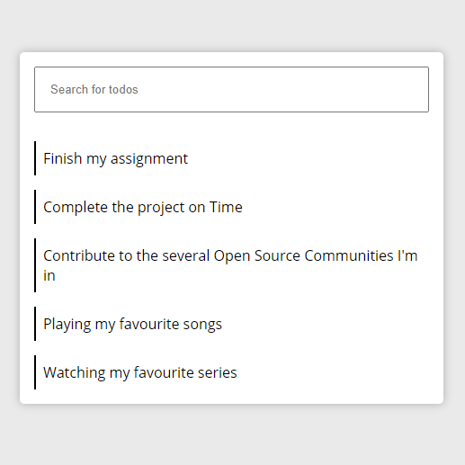

# Build a Custom Search Filter using JavaScript



[Live Demo](https://jomefavourite.github.io/Filter_Functionality_Javascript/)

**How to run the program locally**

By clicking on the file named `index.html`, you'll be able to view the webpage on the browser.

**Explanation of Code**

Read the complete example from my blog - [Let's build a Custom Search Filter](https://favouritejome.hashnode.dev/lets-build-a-custom-search-filter-using-javascript)

```js
// Filters the todo
[...todos].forEach(todo => {
  let todoContent = todo.textContent;
  if (todoContent.toLowerCase().includes(searching)) {
    todo.style.display = 'block';
  } else {
    todo.style.display = 'none';
  }
});
```

- Using [...todos] converts the Nodelist Object to an array, given us access to the forEach() method.
  <br>

  > Well, the forEach() method is available to the Nodelist object, but not all the array methods all available on the Nodelist Object. Then why convert it to an array you might ask, well for consistency sake.

- In the forEach() function, which loops over each todo item a variable todoContent is declared with it's value as the todo.textContent.
  <br>
  > todo are each item in the array which are the list - `li` elements. textContent is a property that's available to each list elements which returns the value of the lists.
  > <br>
- Next line is an if statement condition which checks if todoContent.toLowerCase() includes/has seaching which is what is being inputted.
  <br>

  > Simply the above statement can be represented like this "Hello there!".includes("!") From the representation, it evaluates to true.

- If the condition in the if statement is true at any point in time, then the list elements will be visible display: block - todo.style.display = 'block' other wise the list elements will be invisible display: none - todo.style.display = 'none'.

Created by: [Favourite Jome](https://github.com/jomefavourite)
