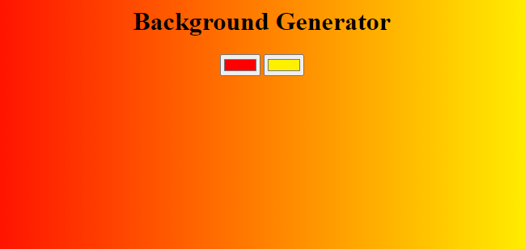

# Background Generator



**How to run the program locally**

By clicking on the file named `BG.html`, you'll be able to view the webpage on the browser.

**Explanation of Code**

```js
let h3 = document.querySelector('h3');
let color1 = document.getElementById('color1');
let color2 = document.getElementById('color2');
let body = document.getElementById('gradient');

document.addEventListener('input', e => {
  if (e.target === color1 || e.target === color2) {
    body.style.background = `linear-gradient(to right, ${color1.value}, ${color2.value})`;
  }

  h3.innerHTML = `linear-gradient(to right, "${color1.value}", "${color2.value}")`;
});
```

From the snippet above, the first 4 lines of code is used to select a particular DOM element into there respective variable declarations `h3`, `color1`, `color2`, `body`.

Next off, an event listener is added to the document, listening for `input` on the webpage, having a callback function with the parameter as the event object `e`.

> Note: The variable `color1` represent the first input element in the HTML file - `BG.html`, while `color2` represent the second input element.

```html
<!-- color1 -->
<input id="color1" type="color" name="color1" value="#ff0000" />

<!-- color2 -->
<input id="color2" type="color" name="color2" value="#fff000" />
```

If the event object property `target` targets either `color1` or `color2`, then there respective values will be changed and also the `body` element of the webpage reflect those changes of the `input` element, by changing the background colour.
