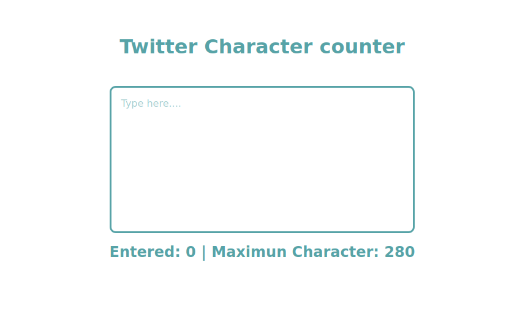

# Twitter Character counter

Just has twitter, this simple javascript program, lets you set a to the characters a user can enter, in this case we set ours to 280 character limits.

<h3>Things you will learn in this project</h3>

* event listener
* query Selectors
* function
* if statement
* window object

**How to run the program locally**

By clicking on the file named `index.html`, you'll be able to view the webpage on the browser.

The `style.css` contains all the styling for this projects, and i have kept the styling at a bare miniumum for you to go wild and make it your own. Please tag us on twitter <a href="https://twitter.com/ChryzHub">@ChryzHub</a> as we would `LOVE` to see your project!!!

The `script.js` contains all the logic for this project.

Code/program owned by:
[@IbrahimOlayinka](https://github.com/IbrahimOlayinka)
